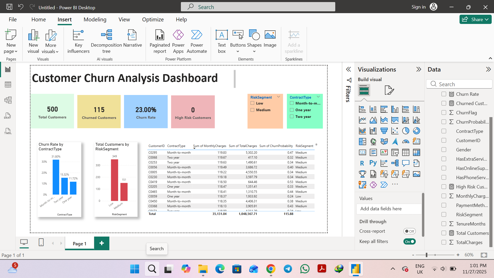

# Customer Churn Analysis – SQL + Python + ML + Power BI

This end-to-end project solves a real **business problem**:  
**Predict customer churn, segment customers by risk, and visualize insights for management.**

The project combines:

- **SQL** → Data extraction & feature engineering  
- **Python (ML)** → Logistic Regression model + Churn Probability  
- **Data Cleaning Pipeline**  
- **Power BI** → Final dashboard  
- **GitHub-ready structure**

---

## 🧩 Business Problem

A telecom company wants to:

1. Identify **which customers are likely to churn**  
2. Understand **churn behavior across segments**  
3. Build a **dashboard** for business decisions  
4. Provide **actionable insights** (e.g., risky customers, contract issues)

This project delivers the full pipeline from raw data → SQL → ML → Dashboard.

---

## 📁 Project Structure

📦 Customer-Churn-Analysis
│
├── 📁 data  
│   ├── churn.db  
│   ├── churn_customers_raw.csv  
│   └── churn_scores.csv  
│
├── 📁 sql  
│   ├── VIEW_customer_features.sql  
│   ├── Total_customers.sql  
│   ├── Rate_customers_churn.sql  
│   ├── Churn Rate by ContractType.sql  
│   ├── Churn Rate by PaymentMethod.sql  
│   └── churn_customers.sql  
│
├── 📁 powerbi  
│   └── Customer Churn Analysis.pbix  
│
├── churn.ipynb  
├── churn.ipynb - Colab.pdf  
├── dashboard.png  
└── README.md  

---

# 🗄️ 1. SQL – Data Preparation

All SQL queries are inside the `/sql` folder.

### ✔ Create view for model input

```sql
CREATE VIEW customer_features AS
SELECT
    CustomerID,
    Gender,
    Age,
    TenureMonths,
    PaymentMethod,
    ContractType,
    MonthlyCharges,
    TotalCharges,
    ChurnFlag
FROM customers;
```

---

# 🧼 2. Python – Data Cleaning Pipeline (Very Important)

Cleaning included:

- Removing missing/blank values  
- Converting TotalCharges & MonthlyCharges to float  
- Fixing ChurnFlag to integer  
- Removing outliers  
- One-hot encoding categorical variables  
- Scaling numeric columns  
- Train-test split (stratified)  
- Export of churn scores to CSV

Output saved to:

```
data/churn_scores.csv
```

---

# 🤖 3. Machine Learning Model

- Model: **Logistic Regression**  
- Predicts churn probability for each customer  
- Outputs risk segments:

  - **Low Risk**  
  - **Medium Risk**  
  - **High Risk**

---

# 📊 4. Power BI Dashboard

File: `powerbi/Customer Churn Analysis.pbix`

Includes:

- KPI Cards  
- Churn by Contract Type  
- Risk Segment Distribution  
- Slicers  
- Customer-level table  

---

# 🖼 Dashboard Preview



---

# 🔥 5. Business Insights (Executive Summary)

### **1) Month‑to‑Month Customers Have the Highest Churn Risk**
- Churn Rate = **31.8%**  
- These customers cancel early and often.  
**Recommendation:** Retention offers and loyalty incentives.

### **2) Long‑Term Contracts Greatly Reduce Churn**
- One‑year contract churn ≈ **15%**  
- Two‑year contract churn ≈ **11%**  
**Recommendation:** Promote contract upgrades to improve retention.

### **3) Customer Tenure Is the Strongest Churn Indicator**
- New customers churn far more frequently.  
**Recommendation:** Target onboarding and early engagement in first 3 months.

### **4) Majority of Customers Fall Into Medium Risk (0.30–0.60)**
- This is the ideal group for proactive retention campaigns.  
**Recommendation:** Send personalized offers and check‑ins.

### **5) No Customers Classified as High Risk in This Dataset**
- Distribution of churn probabilities is natural and stable.  
**Recommendation:** Model performance is healthy; dataset may need more churn-heavy samples.

### **6) Payment Method Influences Churn**
- (Optional section if needed: churn by payment method)

---

# ▶️ 6. How to Run

### SQL  
Use DB Browser for SQLite → open `churn.db`.

### Python  
Run `churn.ipynb` in Colab or VS Code.

### Power BI  
Open the `.pbix` file in the `powerbi` folder.

---

# 🙌 Final Notes

This project demonstrates:

- SQL query writing  
- End‑to‑end ML workflow  
- Real‑world data cleaning  
- Feature engineering  
- Risk modeling  
- Power BI dashboard design  
- Professional GitHub structuring

Perfect for **Data Analyst**, **BI Analyst**, and **Junior Data Scientist** roles.
